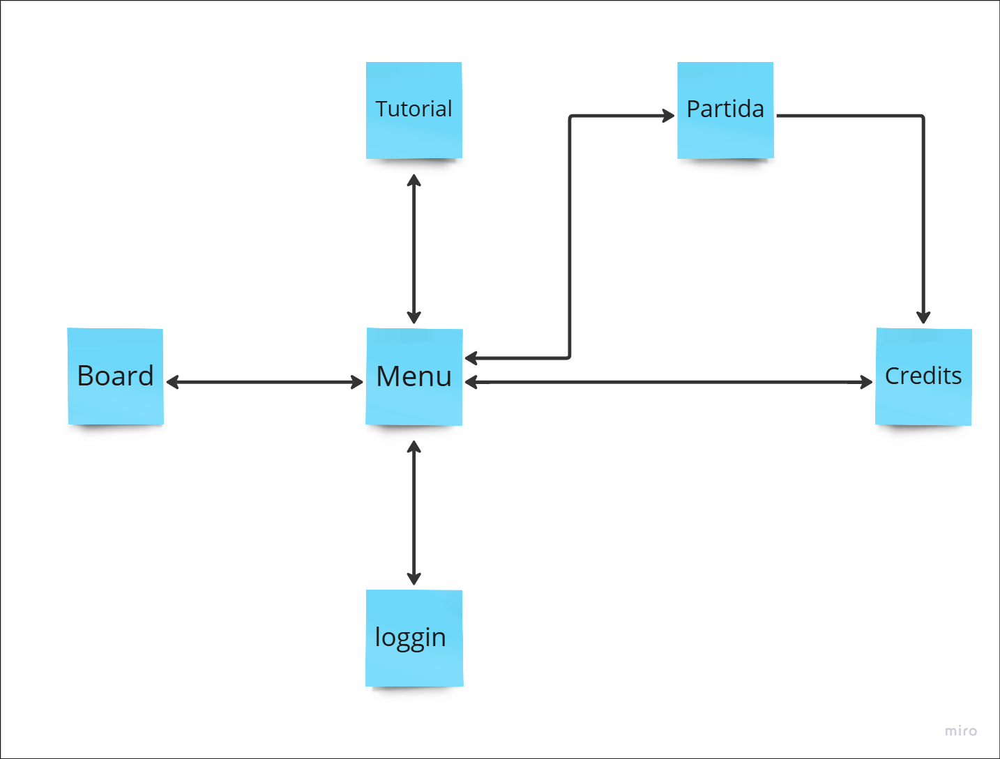
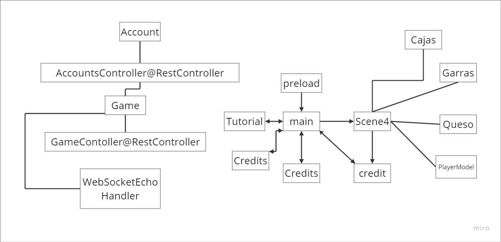
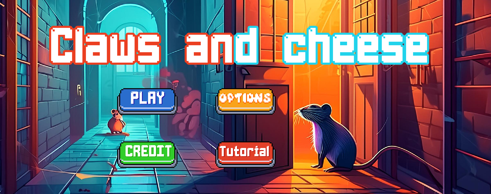
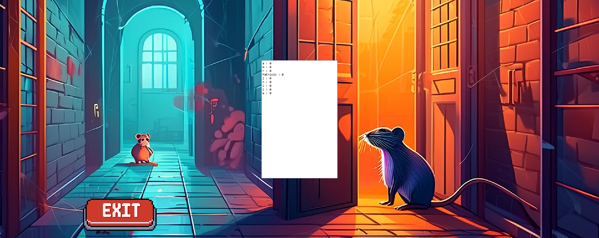
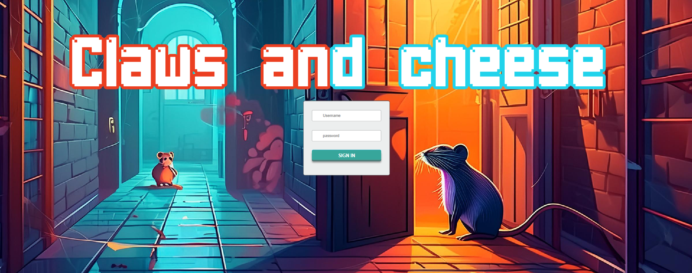
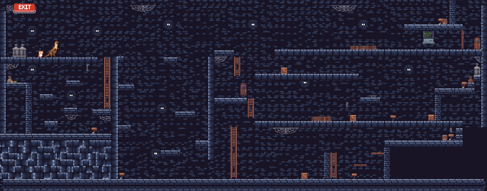
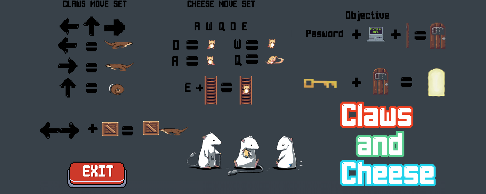
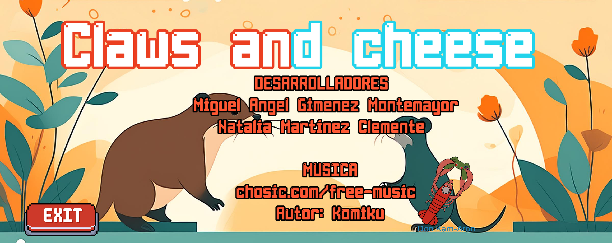

# Juegos en Red - Grupo 3 | Don Kam-Arón   

# “Enjoying the past, living the future”    

# Claws and Cheese    
## GDD V2

Miguel Ángel Jiménez Montemayor    
Natalia Martínez Clemente     

## Índice    
- [Historial de versiones](#item0)
- [Introducción](#item1)   
- [Guión](#item2)   
- [Mecánicas del juego](#item3)    
- [Estados del juego](#item4)   
- [Interfaz](#item5)   
- [Niveles](#item6)   
- [Progreso del juego](#item7)   
- [Personajes](#item8)   
- [Ítems](#item9)   
- [Sonidos y música](#item10)   
- [Miembros del equipo](#item12)   
- [Anexo](#item13)   

  
# Historial de versiones
| Nº Versión  | Fecha actualización | Modificaciones |
|-------------|---------------------|----------------|
| Versión 1   | 17 Oct 2023         | Versión Inicial |
| Versión 2   | 05 Dic 2023         | Eliminadas escenas de carga interactivas, eliminado archivos de guardado, actualizados movimientos personajes, eliminados ciertos niveles del juego, actualización habilidades personajes, actualización mapa esquemático de niveles, eliminado arte y concept |

  
# Introducción 

## Título 
Claws and Cheese 

## Concepto principal    
El juego se desarrolla en una mazmorra, donde nuestros dos protagonistas tendrán que escapar utilizando su ingenio y sus habilidades para superar los obstáculos. Pero tendrán que tener cuidado, porque no podrán hacerlo cada uno por su cuenta. Necesitarán la cooperación entre ambos para poder huir de tan terrible lugar, pues habrá pruebas donde uno solo no podrá superarlas. 

## Características Principales 
- Dos personajes, cada uno con diferentes habilidades.
- Un nivel con puzles a resolver entre los dos personajes.
- Personajes antropomórficos
- Los niveles ya estarán predefinidos, con los puzles hechos a mano y personalizados.
- Estilo Pixel Art.
- La cámara es fija. El escenario se verá por completo para que los jugadores puedan visualizar cómo resolver los distintos puzles.

## Género    
Plataformas 2D cooperativo, puzles. El estilo plataformas resalta las habilidades de cada personaje mientras que la inserción de puzles obliga a ambos jugadores a cooperar y utilizar su ingenio para poder superar los distintos niveles.   

## Propósito y Público Objetivo 
Para todos los públicos, especialmente para el público infantil y joven.    

## Jugabilidad 
Los dos jugadores se deberán coordinar para resolver los puzles y avanzar a través de los niveles. Los personajes podrán interactuar con elementos del escenario (botones, palancas, etc.) y saltar. Además, cada uno tendrá un tamaño y peso distinto, lo cual les permitirá acceder a lugares diferentes e interactuar con elementos distintos. 

## Estilo Visual 
Pixel Art 2D. Este estilo es muy versátil y puede facilitar muchas mecánicas y maquetación del escenario. Además, es un estilo que actualmente está volviendo a tener importancia dentro de los videojuegos.    

## Alcance 
El alcance será de una sola entrega para probar si los juegos cooperativos funcionan. Si el resultado conseguido es bueno, se irán creando más juegos, DLCs y merchandising. 

## Plataforma 
PC. Estará disponible en Steam     

  
# Mecánicas del Juego 

## Mecánicas del Juego 
Cámara 2D vista lateral, cada jugador puede ver el escenario completo. 
- Controles en local: 
  - Movimiento lateral: `A` `D`, `←` `→`   
  - Salto: `W`, `↑`
  - Bajar y subir escaleras (solo Cheese): `E + W/S`
  - Empujar (solo Claws): `caja + ←→`  

- Jugabilidad: el juego está planteado para que se juegue una sola vez. Pues al repetir el juego, los niveles serán los mismos y los puzles también. Por lo tanto, este juego no favorece a la rejugabilidad. Como mucho, se puede volver a jugar para superar el tiempo. 

- Niveles: este juego se compone de un nivel. El primer nivel tendrán que escapar de la mazmorra intentando desbloquear el acceso a la salida, además de encontrar la llave. 
- Intensidad del juego: la intensidad del juego será moderada, tirando a ligera. Cualquier persona podría jugarlo sin problemas. 

- Recursos: en el juego existirán zonas donde cada jugador tendrá que hacer su papel, como puede ser entrar por agujeros pequeños, desbloquear códigos ocultos, llevar un objeto a un lugar determinado, subir escaleras. 

## Mecánicas del Jugador 

Los jugadores tendrán un personaje en concreto que son: 

**Cheese**: Sus características principales es ser pequeño permitiendo así acceder a lugares que no serían accesibles, puede subir escaleras. Las desventajas del ratón es que no es muy fuerte haciendo que no pueda mover casi ningún objeto del entorno. 

**Claws**: Las características principales es que tiene una gran fuerza permitiendo mover cajas. Como Claws es muy grande, no puede acceder a sitios estrechos y tampoco puede subir escaleras. 

## Mecánicas de Niveles 

El juego tiene un nivel con distintas mecánicas.

- Escaleras: hay escaleras en el escenario. Las escaleras solo son interactuables para Cheese.
- Cajas/Objetos móviles: hay cajas normales. Las cajas solo las puede mover Claws.

  
# Estados del Juego 

Una vez iniciado el juego, se muestra el menú del juego, desde el cual se puede acceder a distintas escenas que son:
- **Tutorial**: Enseña los controles que se van a utilizar, además de explicar el objetivo de la escena.
- **PLAY**: Inicialización de la partida, donde los jugadores tendrán que controlar a Garras o Queso para trabajar en equipo y superar los distintos desafíos. Además, tiene un temporizador para saber cuánto tiempo han tardado en superar el nivel.
- **Credit**: Pantalla final que visualiza quiénes han creado el juego, además de los materiales externos que se han utilizado para las distintas escenas.
- **Login**: Botón que lleva a la escena que sirve para unirse al servidor guardando la contraseña, permitiendo así que el usuario se pueda unir. Además, si el usuario intenta acceder a otra cuenta que no es la suya, se mostrará en pantalla si falla la contraseña o si la cuenta está activa, no permitiéndole acceder. Los usuarios y contraseñas se guardan en un JSON específico.
- **Board**: Pantalla que muestra un ranking del tiempo que los jugadores han tardado en superar el nivel.
- **Log off**: Aparece cuando se ha iniciado la cuenta y sirve para desconectar la cuenta, permitiendo así crear otra cuenta o unirte con otra cuenta.

## Diagrama de clases y navegación

Una vez iniciado el juego, se enseña el menú del juego, desde el cual, si la partida es online puedes acceder a un leaderBoard para ver las mejores puntuaciones(las que son distintas de 0) y luego puedes acceder tambien a la escena de juego. Para el modo APIRest, se ha utilizado el guardado permanente de datos en un JSON. Este guardado mantiene los datos de los usuarios que se han loggeado, sus contraseñas y el tiempo que han tardado en acabar la partida. Al estar en un solo ordenador, solo se podrá loggear una persona y se guardará esa información.

## Menú principal

En el menú principal aparece el logo del juego, los botones para inicializar partida, loguear o desloguear, el tutorial, ranking y los créditos.

## Board

Muestra el tiempo que ha tardado en finalizar el nivel de todos los jugadores de forma ascendente.

## Login

Pantalla que permite crear la cuenta del usuario guardando sus datos o acceder a otra cuenta ya creada.

## Pantalla de juego

Pantalla principal donde los jugadores interactúan para superar los desafíos usando los personajes ya mencionados anteriormente.
Para jugar, cada jugador tiene unas teclas asignadas. Tendrán que mover cajas, subir escaleras, coger una llave y encontrar un código secreto para poder salir.

## Tutorial

Pantalla la cual muestra los controles de los personajes además del objetivo del nivel.

## Credits

Pantalla la cual muestra a los desarrolladores del videojuego y las licencias que se han utilizado para hacer el videojuego.

  
# Progreso del Juego 

El progreso del juego va a ser lineal porque se necesita a los dos personajes para superar los distintos retos.   
Esto quiere decir que para poder avanzar necesitas realizar los puzles en un mismo orden y con la colaboración entre los dos jugadores.   
Si no se cumplen los dos requisitos, no se puede avanzar en el juego.   

## Diseño del juego
El estilo del juego es de tipo Pixel Art, con colores suaves y nítidos. Sus personajes son Garras y Queso, que tienen colores básicos que representan a cada jugador, y tienen distintas animaciones para simular que están vivos. Además, sus escenarios están constituidos para hacer que se trabaje en equipo, de modo que no se puedan superar individualmente. Se ha diseñado el escenario para que se pase el nivel de una manera en específica, pero animamos a los jugadores que se pase el nivel de distintas maneras.

  
# Personajes 

## Jugador 

Los dos jugadores controlarán a los personajes Claws y Cheese, cuyas ventajas y desventajas se explicaron anteriormente.  
 
El objetivo de estos es escapar de la mazmorra.   
Claws: Es un animal muy grande y fuerte, haciendo que sea el único capaz de mover objetos.  
Cheese: Es un animal muy pequeño, lo que le permite moverse por espacios reducidos, como tuberías, para llegar a otras salas.

  
# Ítems 

No hay un inventario como tal. Sin embargo, los personajes podrán recoger objetos como la llave. Al recoger este objeto hará que la salida esté abierta haciendo que puedan salir del escenario.

Algunos de los ítems del escenario que no se podrán recoger, pero sí se pueden utilizar, serán cajas de madera o cables en cajas de luz. 

## Protocolo
La comunicación entre clientes y el servidor usando WebSockets tiene lugar solo en la escena Play del juego.

Al abrir la escena, se inicia la conexión con WebSockets, detectada por WebSocketsEchoHandler. Si no hay ninguna partida abierta a la que le falten jugadores, se crea una nueva partida (Game); si no es el caso, se une al jugador asociado con dicha conexión a la partida abierta.

Una vez un jugador se ha unido a una partida, WebSocketsEchoHandler envía un mensaje para informar a la escena Play cuál es el personaje que controla ese jugador (Garras o Quesos). Esto se consigue debido a que todos los mensajes que reciben los clientes tienen un atributo que hace referencia a una función implementada en Play, y al recibir un mensaje, el cliente ejecuta la función asociada. En el caso del mensaje enviado cuando un jugador es añadido a una partida, la función es setPlayer.

Inmediatamente después de saber qué personaje controla, el cliente empieza a mandar mensajes por el Socket con el estado de dicho personaje (posición, velocidad, sprite, etc.), y al recibirlo, el handler se lo envía al resto de sesiones cuyo Game sea el mismo que el emisario. Estos mensajes se mandan aunque el emisario sea el único jugador dentro de la partida.

Mientras se ejecuta la función setPlayer, el juego comprueba constantemente si hay 2 jugadores en la partida; para ello, envía las peticiones GET `url/games/{id}` mencionadas anteriormente. Mientras falten jugadores, la partida no comenzará.

En cuanto un segundo jugador se une al Game, el juego comienza para ambos. Los mensajes con la información de los personajes que envía cada cliente son recibidos por el otro e invocan su función Update, lo que permite sincronizar ambos clientes para que todos los personajes se actualicen según las acciones de los distintos jugadores.

Durante el transcurso de la partida, si un jugador usa un Power Up que afecte al otro, se manda un mensaje por el Socket, con un funcionamiento similar al anterior, aunque en vez de invocar a la función Update del otro cliente invoca una función determinada según el Power Up usado.

Finalmente, cuando un jugador llega a la meta, manda dos mensajes:
- El primero sirve para actualizar la posición del personaje que ha llegado a la meta en el otro cliente.
- El segundo mensaje avisa a WebSocketsEchoHandler de que la partida ha terminado y que puede ser eliminada de la lista de Game.

Tras esto, ambos clientes pasan a la escena Winner, donde se muestra al jugador vencedor. Esta escena carece de cualquier funcionalidad de WebSockets, por lo que ambos jugadores pueden volver al menú principal y volver a buscar partida, en cuyo caso se crean sesiones de WebSocket nuevas, ya que las antiguas se han eliminado.

  
# APIRest 

Para implementar la APIRest, primero hemos importado springBoot y las librerías y dependencias necesarias para poder utilizar springboot y el puerto LocalHost:8080 en el archivo pom.
Luego, hemos creado varios archivos .java, los cuales Accoutns.java tiene la información que se quiere guardar (nombre,id,tiempo,etc), AccountController.java  tiene los métodos CRUD necesarios para poder guardas, actualizar y eliminar la información. Para ello en postConstrucInit inicializamos los datos, comprobando si existe o no el archivo JSON al iniciar el servidor. Si existe, lo lee y lo copia en un archivo temporal, añade los nuevos datos y luego lo copia todo al archivo original. Get simplemente devuelve el mapa de la información. Put comprueba que el id del account y si no es nulo hace put en ese usuario. Delete funciona de forma similar pero eliminando el archivo.
En el archivo de clawsandcheeseApplication.java simplemente se ejecuta la aplicación con Spring.

Hemos creado también un archivo LeaderBoard para ver las puntuaciones, este archivo utiliza un Dom donde se muestra la información. Para recoger esta información utilizamos loadAccounts, la cual carga las cuentas. Realiza una solicitud AJAX y devuelve las cuentas. Luego ordena las cuentas y las muestra en el dom.

En MainScene utilizamos tambien loadAccounts al inicio para indicar que botones se deben mostrar si ya te has loggeado o no. Para el botóns LogIn (se crea un dom donde se muestra una caja a guardar el usuario y la contraseña y se ocultan los botones, cuando te loggeas, se desocultan los botones y se cierra ese dom), se comprueba una serie de requisitos, como si el jugador no existe o si, si no existe crea un usuario, y si sí, lo carga. Si se mete mal la contraseña no te permitirá entrar (el nombre es único, no hay duplicados), si la cuenta está activa tampoco te podrás loggear.
Para logOut se cargan y se actualizan las cuentas. Para actualizarlas se llama al método PUT dell CRUD.

En la escena de juego se utiliza la carga de archivos y datos de las cuentas, como anteriormente, igual que la actalización de las cuentas, la cual se realiza al cambiar de escena. 

También se ha implementado el timer que utiliza un evento para actualizar el tiempo, sumando 1 por cada vuelta de loop.

  
#WebSockets
para incluir WebShockets hemos tenido que crear varios documentos nuevos y modificar los ya existentes.
AccountControler.java se ha modificado para que el método post se sincronice cuando se llama. Además de las comprobaciones de la anterior parte, ahora también se asegura de escribir el JSON de manera corecta y de cerrar el documento bien. Un método añadido ha sido el PreDestroy, el cual se utiliza cuando se acaba la partida para guardar las puntuaciones correctamente cuando un jugador termina la partida y el servidor se cierra. Este método se asegura de sobreescribir el documento justo antes de hacer serverClose. 
El archivo account ahora tambien tiene un id_partida que se usará para hacer match y un WebSocketSession para guardar la sesión.
El archivo principal es WebshoketEchoHandler, el cual manejará las comunicaciones en tiempo real cliente servidor. 
Por un lado, Match se usará para conectar a varios jugadores. Primero guardamos en un array de dos posiciones los nombres de los jugadores, de este modo el primero que se conecte será el raton u el segundo la nutria. Si el contador no inicia se crea una partida, luego si es menor de 2 (dos jugadores máximo por partida) se accede al último juego en la lista de partidas y se añade al jugador a esa partida, se obtiene el jugador de account gracias al id que tiene. Se actualizan los atributos del jugador y se maneja las excepciones. Si el contador llega a dos, se reinicia y se añaden jugadoresa otra sesión.
New Game creará un nuevo juego de la clase Game.java, que solo tiene una id de sesion de sala y los jugadores.
afterConnectionClosed se usará para eliminar la sesión de id y sendOtherParticipants se encarga de enviar la información guardada en el JSON del jugador al otro jugador, asegurándose que no se envía el mensaje a si mismo, enviando esa información como un mensaje.

Para gestionar el manejo del juego entre jugar en local o en línea, se ha duplicado la escena de juego para el juego en línes. Entonces si el jugador no hace logging jugará en local, si hace logging, jugará en línea enviando a los jugadores a la escena duplicada. Las funciones LoggIn funcionan igual que en la anterior práctica.

En la nueva escena hay que realizar una serie de acciones nuevas. En INIt se inician y calculan la informacion de los jugadores junto con la informacion de los objetos de la escena, cajas, puertas y llave, que son las que se tienen que sincronizar.
Luego en el mismo Init, para crear el Shocket, se crea per se un WebShocket con la dirección echo, y se crean los controles para el OnOpen, onClose y OnMessage (este último es el que envia los mensajes a traves del shocket, sincronizando la informacion del JSON.
En el metodo Update controlaremos que el jugador exista, cuando está hecho esto si no está conectado se conecta, despues se asignan los nombres y las actualizaciones de cada jugador. Para el movimiento de las cajas, solo envía la informacion de actualización el personaje Claws, es lo único más diferente en cuanto movimientos. El resto de informaciones se mandan simultáneamente entre ellos, Claws pasa su informacion a Cheese y viceversa. Tambien existen dos variables booleanas que se sincronizan para saber cuando las puertas se desbloquean al coger la llave ya cuando se coge la llave.
Para el cambio de escena, actualizamos la posicion de los jugadores, la información común y después se transporta al jugador que no haya pasado a la puerta para que salga de la escena. Se cargan las cuentas de nuevo, se actualizan para guardar la informacion y se cierra el servidor al acabar la partida.

  
# Música y Sonidos 

Para la música, alternamos entre música alegre y música ambiental de zoo. 

Todas las licencias de la música serán CC0 o CCBy (es música de libre uso). 

  
## Integrantes
- Miguel Ángel Jiménez Montemayor / Correo: ma.jimenez.2021@alumnos.urjc.es / Cuenta: miekl13
- Natalia Martínez Clemente / Correo: n.martinezc.2020@alumnos.urjc.es / Cuenta: NatillasConNata

  
# Anexos 
Sprites botones del juego: [https://pixellarion-games.itch.io/pixelart-buttons](https://pixellarion-games.itch.io/pixelart-buttons)
